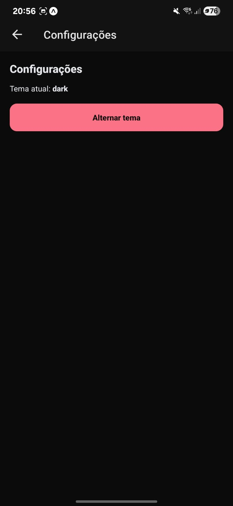

# InfnetFood

Aplicativo de pedidos e delivery desenvolvido em **React Native (Expo)** como parte do Projeto Integrado.

---

## 🚀 Como executar

1. Clone o repositório:

   ```bash
   git clone <URL> infnetfood
   cd infnetfood
   ```

2. Instale as dependências:

   ```bash
   npm install
   ```

3. Inicie o app:

   ```bash
   npx expo start
   ```

   * **a** → Android emulador
   * **i** → iOS emulador (somente macOS)
   * **w** → Web
   * Ou use o **Expo Go** no celular (QR code)

---

## 📂 Funcionalidades

* Login mockado
* Home com categorias (Lanches, Bebidas, Sobremesas)
* Lista de produtos por categoria
* Carrinho com itens, quantidades e total
* Perfil do usuário
* Tela de pedidos
* Mapa simulado com restaurantes
* Detalhe de restaurante
* Checkout com validação
* Tema claro/escuro
* Notificações locais simuladas
* Testes unitários básicos (Jest)

---

## 📸 Documentação

Os prints de cada funcionalidade estão na pasta `/docs` e também são exibidos aqui:

<p align="center">
  
  
  
</p>

<p align="center">
  
  
  
</p>

<p align="center">
  
  
  
</p>

<p align="center">
  
  
  
</p>
